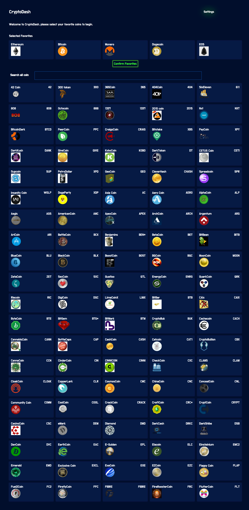
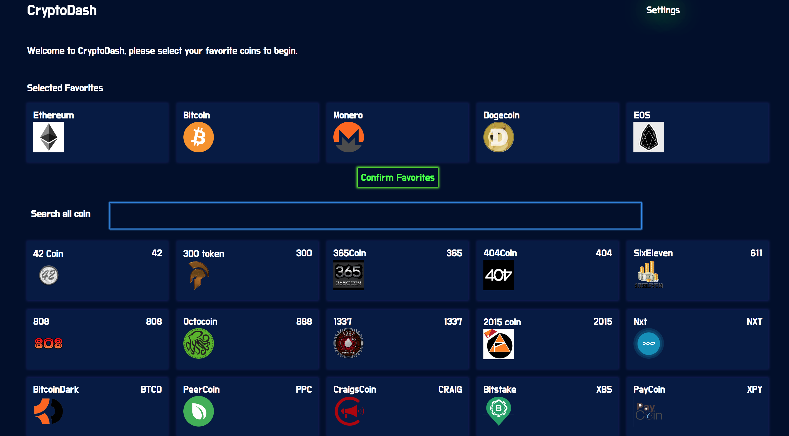
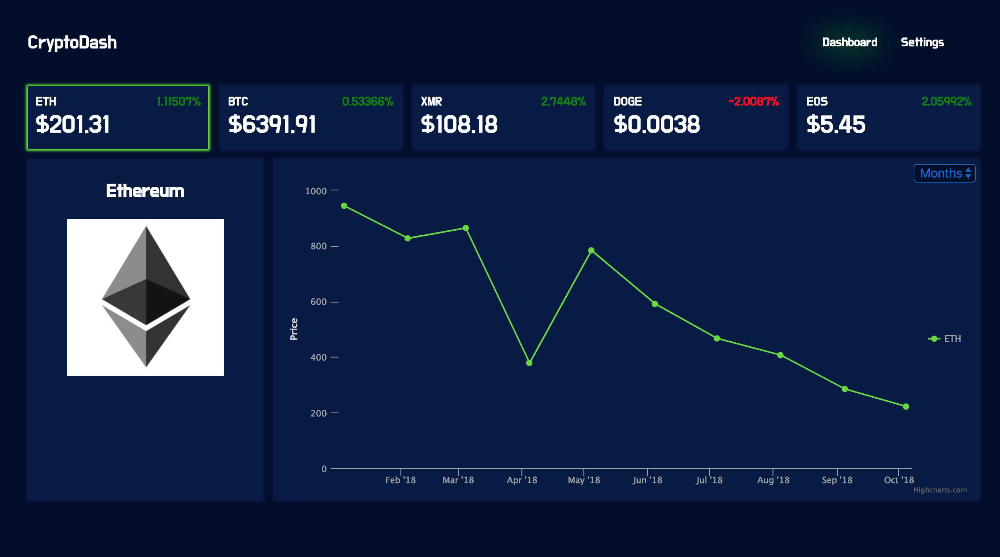

This project was bootstrapped with [Create React App](https://github.com/facebook/create-react-app).

### Benefits of choosing create-react-app
* Official React.js starter project by Facebook
* "Create React apps with no build configuration"
* Only 3 commands to an enterprise-grade web application
  
    - npm create-react-app react-dashboard
    - cd react-dashboard
    - npm start

* hot reloading by default
* immediately start coding
* command for optimized production build

### Below are the technologies we have used for this Project 

* <b>React</b> - It is an open-source JavaScript library which is used for building user interfaces specifically for single page applications.
* <b>Styled-components</b> - It is a library that gives you the way to handling styling using CSS-in-JS.
* <b>CSS Grid</b> - The CSS Grid Layout Module offers a grid-based layout system, with rows and columns, making it easier to design web pages without having to use floats and positioning.
* <b>Highcharts</b> - Interactive JavaScript charts for your web pages.
* <b>cryptocompare API</b> - This is the best way to get intraday trading data for cryptocurrencies.
* <b>Async/await</b> - There's a special syntax to work with promises in a more comfortable fashion
* <b>Fuzzy Search</b> - A fuzzy search is a process that locates Web pages that are likely to be relevant to a search argument even when the argument does not exactly correspond to the desired information.
* <b>Lodash</b> - for functional programming
* <b>Webkit inspector</b> -  For debugging
* <b>localstorage - to set and retrieve data from web browser
* <b>Google fonts</b> - fonts 

### UI screen for reference

### Thanks & references
* Thanks to Udemy & Digital Hermits